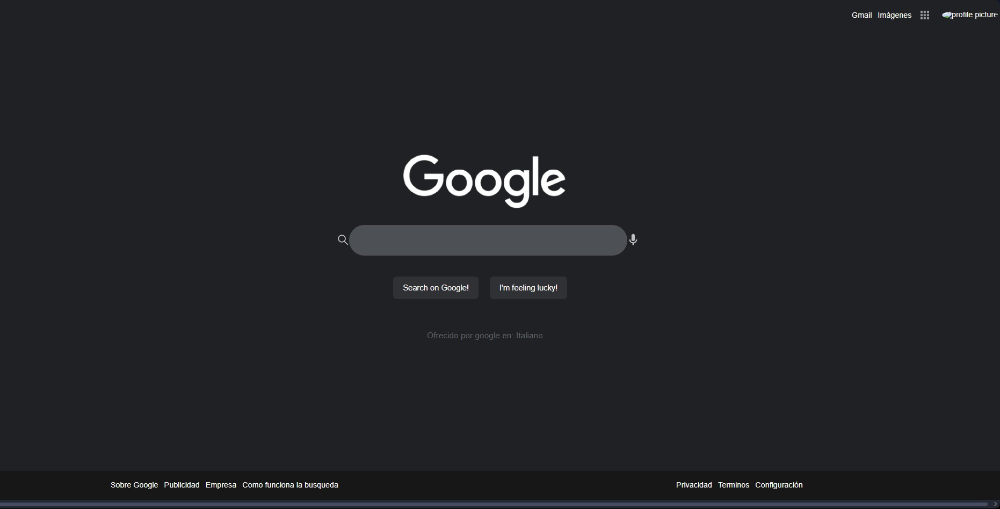

# [Curso Práctico de HTML y CSS](https://platzi.com/cursos/html-practico/) 

_(Ctrl + Click or Middle-click to open in a new tab)_

Este repositorio contiene todo el material y código fuente que he desarrollado durante el **Curso Práctico de HTML y CSS**. 
Donde he construido un clon de Google usando HTML y CSS. Durante el curso he aprendido a estructurar y estilizar un sitio web completo, desde el header hasta el footer, usando técnicas de maquetación como Flexbox y Grid, utilizando la página de buscador de Google.

## 🚀 ¿Qué contiene?
- Archivo HTML
- Estilos CSS
- Proyecto final: una landing page
- Notas personales y recursos adicionales

## 📸 Vista previa

## 🛠️ Tecnologías utilizadas
- HTML5
- CSS3
- Git y GitHub

## Estructura del proyecto:
📦 CSS-Grid-Basico-Platzi
├── index.html
├── styles/
│   └── main.css
├── assets/
│   └── imagenes
└── README.md

## 📚 Resources / References
- Plataforma: [Platzi](https://platzi.com)
- Enlace del curso: [Curso Práctico de HTML y CSS](https://platzi.com/cursos/html-practico/)

## ✍️ Autor
Hecho con 💚 por @avidevcode
